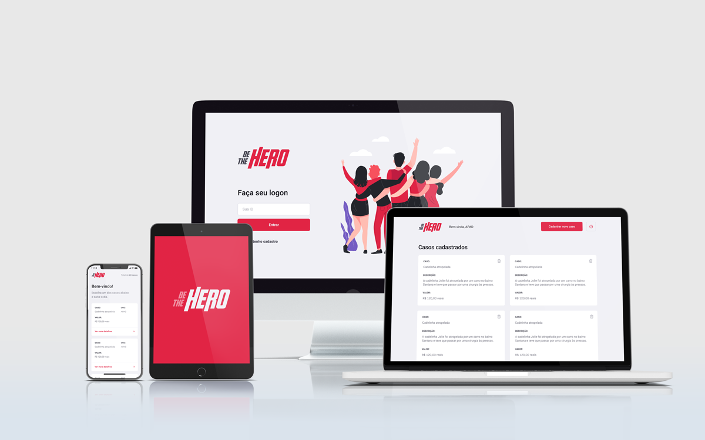

<h1 align="center">
    
</h1>

<h3 align="center">
  Semana OmniStack 11.0 Project
</h3>

  

  

## :computer: Project

Be the hero was part of the **"SemanaOmnistack 11.0"** Workshop from [Rocketseat](https://github.com/Rocketseat). Is a project to connect people who are willing to help Non-governamental-organizations and associations.

## :rocket: Technologies

This project was developed with the following technologies:

- [Node.js](https://nodejs.org/en/) 
- [React](https://reactjs.org)
- [React Native](https://facebook.github.io/react-native/)
- [Expo](https://expo.io/)

## :bar_chart: Layout

  

  To access the layout you can use [Figma](https://www.figma.com/file/2C2yvw7jsCOGmaNUDftX9n/Be-The-Hero---OmniStack-11?node-id=0%3A1).

## :memo: License

This project is under the MIT license. See the [LICENSE](LICENSE.md) for details.

---

Made with ♥ by Victor Alvarenga :wave: [Get in touch!](https://www.linkedin.com/in/victoralvarenga/)